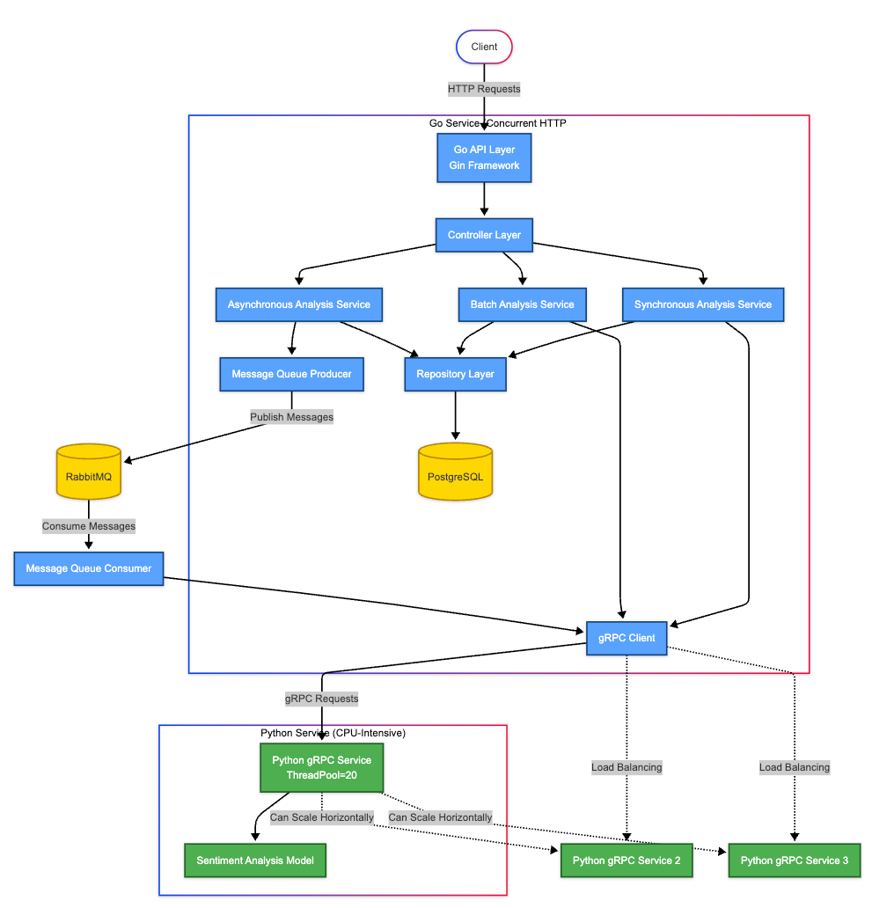

# GinSentinel: Go+Python Sentiment Analysis Platform

> Supercharged Gin framework with plug-and-play Python ML modules via gRPC. Experience the performance of Go with the ML flexibility of Python in a single unified architecture. Features streaming APIs, asyncio processing, and comprehensive observability. Deploy instantly with Docker Compose and scale effortlessly.

## Overview

This service provides sentiment analysis of text through multiple interface methods (REST API, gRPC, and asynchronous message queues), supporting high concurrency and multilingual analysis.

## Architecture




## Project Structure

```
.
├── cmd/                  # Application entry points
│   └── main.go           # Main application
├── configs/              # Configuration files
├── internal/             # Internal packages
│   ├── api/              # API layer
│   ├── controllers/      # Request handlers
│   ├── grpc/             # gRPC client
│   ├── middleware/       # HTTP middleware
│   ├── models/           # Data models
│   ├── mq/               # Message queue client
│   ├── repositories/     # Data access layer
│   └── services/         # Business logic
├── proto/                # Protocol buffers definitions
├── python-service/       # Python gRPC service
│   ├── server.py         # gRPC server
│   └── sentiment_model.py # Sentiment analysis model
└── scripts/              # Utility scripts
```

### Core Components

1. **REST API Layer (Go/Gin)**
    - Handles HTTP requests for sentiment analysis
    - Supports single text, batch, and async analysis
    - Endpoints for history retrieval and health checks

2. **gRPC Service (Python)**
    - Implements sentiment analysis algorithm
    - Provides both unary and streaming RPCs
    - Uses ThreadPoolExecutor for parallel processing

3. **Queue System (RabbitMQ)**
    - Handles asynchronous processing requests
    - Enables scaling through distributed processing
    - Provides task queues and result queues

4. **Data Storage (PostgreSQL)**
    - Stores analysis results and metadata
    - Supports result retrieval and history tracking
    - Optimized for concurrent access

## API Endpoints

### REST API

```
POST /api/v1/sentiment/analyze     - Analyze single text (synchronous)
POST /api/v1/sentiment/batch       - Analyze multiple texts
POST /api/v1/sentiment/analyze/async - Analyze text asynchronously
GET  /api/v1/sentiment/history     - Retrieve analysis history
GET  /api/v1/health                - Service health check
```

### gRPC Service

```protobuf
service SentimentAnalyzer {
  rpc AnalyzeSentiment(SentimentRequest) returns (SentimentResponse) {}
  rpc BatchAnalyzeSentiment(stream SentimentRequest) returns (stream SentimentResponse) {}
}
```

## Implementation Details

### Data Flow

1. **Request Handling**:
    - Request is received via REST API
    - Controller validates input and calls service layer
    - Service layer calls repository or external services

2. **Synchronous Analysis**:
    - Text is sent to gRPC service for analysis
    - Results are returned to client and optionally stored

3. **Asynchronous Analysis**:
    - Request is queued in RabbitMQ
    - Worker processes queue and stores results
    - Client can retrieve results via request ID

### Concurrency Model

- REST API uses Gin's concurrency model with goroutines
- gRPC server uses Python's ThreadPoolExecutor with 20 workers
- Database uses connection pooling with 10-100 connections
- Message queue handles load distribution for async processing

## Running the Service

### Using Docker Compose (Recommended)

The simplest way to run the complete service:

```bash
# Build and start all services
./run-docker.sh

# Or manually:
docker-compose build --no-cache
docker-compose up -d

# Check logs
docker-compose logs -f

# Stop all services
docker-compose down
```

### Manual Setup

#### Prerequisites
- Go 1.23+
- Python 3.9+
- PostgreSQL
- RabbitMQ
- Protocol Buffers compiler

#### Step 1: Install and Setup Buf
```bash
# Install Buf CLI
make install-buf

# Initialize Buf in the project (if not already done)
make init-buf
```

#### Step 2: Generate Protocol Buffer Code
```bash
# Generate both Go and Python gRPC code
make gen-proto
```

#### Step 3: Start Dependencies
```bash
# Start Postgres and RabbitMQ containers
make run-deps

# Create development database (if needed)
make create-dev-db
```

#### Step 4: Build and Run the Service
```bash
# Build the Go application
make build

# Run the application
make run-local
```

### Testing

```bash
# Run the API tests
./test-api.sh

# Run Go tests
make test
```

### Maintenance Commands

```bash
# Stop running service
make stop

# Clean generated files
make clean

# Show container logs
make docker-logs

# Run database migrations
make migrate

# Lint Protocol Buffers
make lint-proto

# Check for breaking Protocol Buffer changes
make breaking-proto
```

### See All Available Commands

```bash
make help
```

This will show all available make targets with descriptions.

## Runtime Flow

### Startup Sequence

1. **Database Initialization**
    - PostgreSQL database initializes with required schemas
    - Connection pools are established for optimal performance

2. **Message Queue Initialization**
    - RabbitMQ starts and declares required queues
    - Exchange and binding configurations are applied

3. **Python Service Startup**
    - Python gRPC server initializes the sentiment model
    - Server starts listening on port 50051 with a ThreadPool of 20 workers

4. **Go Service Startup**
    - Configuration is loaded from files and environment variables
    - Database and message queue connections are established
    - REST API server starts on port 9001
    - Health check endpoint becomes available

### Request Processing Flow

#### Synchronous Analysis Request:
1. Client sends POST request to `/api/v1/sentiment/analyze`
2. Gin router routes request to `SentimentController.AnalyzeSentiment`
3. Controller validates request and calls `SentimentService.AnalyzeSentiment`
4. Service creates gRPC request and sends to Python service
5. Python service analyzes text and returns sentiment data
6. If `store_result=true`, result is stored in PostgreSQL
7. Response is formatted and returned to client

#### Batch Analysis Request:
1. Client sends POST request to `/api/v1/sentiment/batch`
2. Controller processes request and calls `SentimentService.BatchAnalyzeSentiment`
3. Service opens gRPC stream to Python service
4. Multiple texts are streamed for analysis
5. Results are collected and optionally stored in database
6. Complete batch results are returned to client

#### Asynchronous Analysis Request:
1. Client sends POST request to `/api/v1/sentiment/analyze/async`
2. Controller calls `SentimentService.AnalyzeSentimentAsync`
3. Service publishes message to RabbitMQ task queue
4. Client receives request ID immediately
5. Worker processes message from queue
6. Worker sends text to Python service for analysis
7. Result is stored in database and published to result queue
8. Client can query result using request ID

### Shutdown Sequence

1. SIGTERM or SIGINT signal is received
2. Open HTTP connections are allowed to complete (grace period)
3. Database connections are properly closed
4. Message queue connections are properly closed
5. Python gRPC server shuts down gracefully
6. System resources are released

### Error Handling

- REST API applies middleware for consistent error handling
- Database operations use transactions where appropriate
- Failed analyses are logged with detailed error information
- Health check endpoint provides system status


## Key Features

- **High Concurrency**: Processes 45+ requests/second with 16× performance gain over sequential processing
- **Multiple Interfaces**: REST API, gRPC, and async queue processing
- **Multilingual Support**: English and Chinese language analysis
- **Scalable Architecture**: Containerized with Docker for easy scaling
- **Comprehensive Logging**: Structured logs with rotation for production monitoring

## Performance

| Test Type | Throughput | Avg Response Time | Success Rate |
|-----------|------------|-------------------|--------------|
| Sequential | 2.82 req/sec | 354ms | 100% |
| Concurrent | 45.45 req/sec | 22ms | 100% |

## Best Practices Implemented

- **Clean Architecture**: Separation of concerns with controllers, services, and repositories
- **Dependency Injection**: Services and repositories are injected into controllers
- **Environment Configuration**: Configuration via files and environment variables
- **Structured Logging**: Consistent logging with contextual information
- **Graceful Shutdown**: Proper handling of termination signals
- **Error Handling**: Consistent error responses and internal error management
- **Health Checks**: Endpoints for monitoring service health
- **Containerization**: Docker containers for consistent deployment
